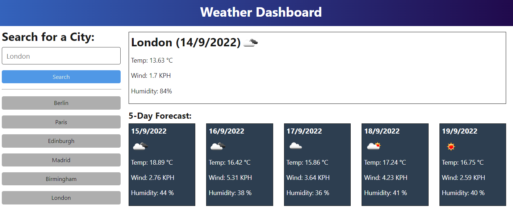

# Server-Side APIs: Weather Dashboard

## Purpose
This project is to build a weather dashboard that will run in the browser and feature dynamically updated HTML and CSS.

## User Story

```text
AS A traveler
I WANT to see the weather outlook for multiple cities
SO THAT I can plan a trip accordingly
```

## Acceptance Criteria

* Create a weather dashboard with form inputs.
  * When a user searches for a city they are presented with current and future conditions for that city and that city is added to the search history
  * When a user views the current weather conditions for that city they are presented with:
    * The city name
    * The date
    * An icon representation of weather conditions
    * The temperature
    * The humidity
    * The wind speed
  * When a user view future weather conditions for that city they are presented with a 5-day forecast that displays:
    * The date
    * An icon representation of weather conditions
    * The temperature
    * The humidity
  * When a user click on a city in the search history they are again presented with current and future conditions for that city

## Mock-Up

The following image shows the web application's appearance and functionality:



## Built With

* [HTML](https://developer.mozilla.org/en-US/docs/Web/HTML)
* [CSS](https://developer.mozilla.org/en-US/docs/Web/CSS)
* [JavaScript](https://developer.mozilla.org/en-US/docs/Web/javascript)
* [Moment.js](https://momentjs.com/docs/)
* [Bootstrap](https://getbootstrap.com/)
## Output
[Live Page](https://vbugana.github.io/Weather-Dashboard/)
## License
This project is licensed under the MIT License
